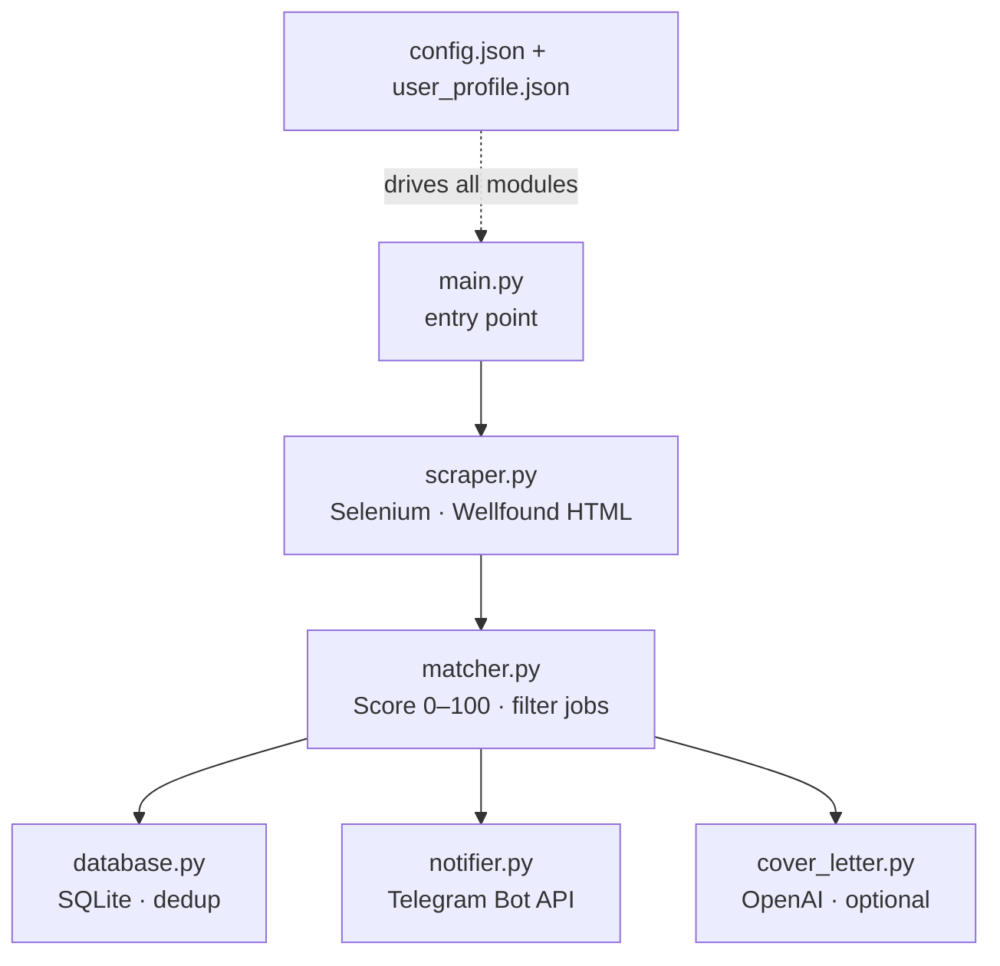

# 🎯 Wellfound Job Scraper


> Automated job discovery, scoring, and notification — straight from Wellfound to your Telegram.

---

## 📖 About the Project

**Wellfound Job Scraper** is an end-to-end job hunting automation tool that scrapes startup job listings from Wellfound, scores each listing against your personal skill profile, persists results in a local SQLite database, and fires tailored Telegram alerts for the best matches — all without you lifting a finger. Optionally, it can call the OpenAI API to draft a personalised cover letter for every job that clears your relevance threshold, so you can apply faster and smarter.

---

## ✨ Features

- 🔍 **Smart Scraping** — Selenium-powered with anti-detection user-agent rotation and configurable rate limiting.
- ⚖️ **Relevance Scoring** — 0–100 score per job based on skill matches, keyword weight, and location bonus.
- 🗄️ **Persistent Storage** — SQLite database tracks seen jobs, deduplicates results, and logs notification state.
- 📩 **Telegram Alerts** — Batched, Markdown-formatted notifications sent directly to your Telegram chat.
- 📝 **Cover Letter AI** — Optional OpenAI integration generates a tailored cover letter per matched job.
- ⚙️ **Config-Driven** — Two JSON files control all runtime behaviour — no code changes needed for tuning.

---

## 🏗️ Architecture

Here's how data flows from Wellfound to your Telegram inbox:



---

## 📦 Module Breakdown

| Module | Description |
|--------|-------------|
| `scraper.py` | Visits Wellfound search pages with Selenium, rotates user-agents, and returns structured job dicts including title, company, skills, and apply URL. |
| `matcher.py` | Computes a 0–100 relevance score per job using weighted skill/keyword substring matching plus a location bonus. Filters by `min_match_score`. |
| `database.py` | Persists jobs to SQLite with deduplication via a unique job ID constraint. Tracks notification state so you never get duplicate alerts. |
| `notifier.py` | Formats and sends Telegram alerts in configurable batches. Reads bot token and chat ID from environment variables. |
| `cover_letter.py` | Optional module. Calls OpenAI's chat completions API to generate a tailored cover letter per job when `OPENAI_API_KEY` is set. |

---

## 🚀 Getting Started

**1. Clone and install dependencies**

```bash
git clone https://github.com/your-username/wellfound-job-scraper.git
cd wellfound-job-scraper
pip install -r requirements.txt
```

**2. Set up your configuration files**

Two config files live inside `config/` — see the detailed guides linked below for every available option.

**3. Create your `.env` file**

Add your secrets to a `.env` in the project root. **Never commit this file.**

```bash
TELEGRAM_BOT_TOKEN="your_token_here"
TELEGRAM_CHAT_ID="your_chat_id"
OPENAI_API_KEY="sk-..."   # optional — only needed for cover letters
```

**4. Run the scraper**

```bash
python main.py
```

Watch jobs flow into your Telegram! 🎉

---

## 📚 Configuration Deep-Dives

Full documentation for each config file lives alongside the files themselves:

| File | Guide | Description |
|------|-------|-------------|
| ⚙️ `config/config.json` | [`config/README.md`](config/README.md) | Scraper limits, Telegram settings, cover letter model, DB path, log level — every knob explained. |
| 👤 `config/user_profile.json` | [`config/README.md`](config/README.md) | Skills, keywords, locations, and minimum match score — tune these for better job relevance. |

---

## 📁 Project Structure

```
wellfound-job-scraper/
├── main.py                  # Entry point
├── src/
│   ├── scraper.py           # Wellfound scraping (Selenium)
│   ├── matcher.py           # Job scoring & filtering
│   ├── database.py          # SQLite persistence
│   ├── notifier.py          # Telegram notifications
│   └── cover_letter.py      # OpenAI cover letter generation
├── config/
│   ├── config.json          # Runtime configuration
│   ├── user_profile.json    # Your personal job preferences
│   ├── README.md            # Module guide → src/
│   └── README_CONFIG.md     # Config file reference
├── data/                    # Auto-created: jobs.db + logs
├── .env                     # Secrets (do not commit!)
└── requirements.txt
```

---

## 💡 Tips

- If scraping is slow or failing, try lowering `max_pages`, increasing `delay_seconds`, or setting `headless: false` to debug visually.
- If Telegram messages look broken, make sure `message_format` is set to `"Markdown"` (case-sensitive).
- Keep your `skills` and `keywords` specific — overly generic terms can inflate match scores.
