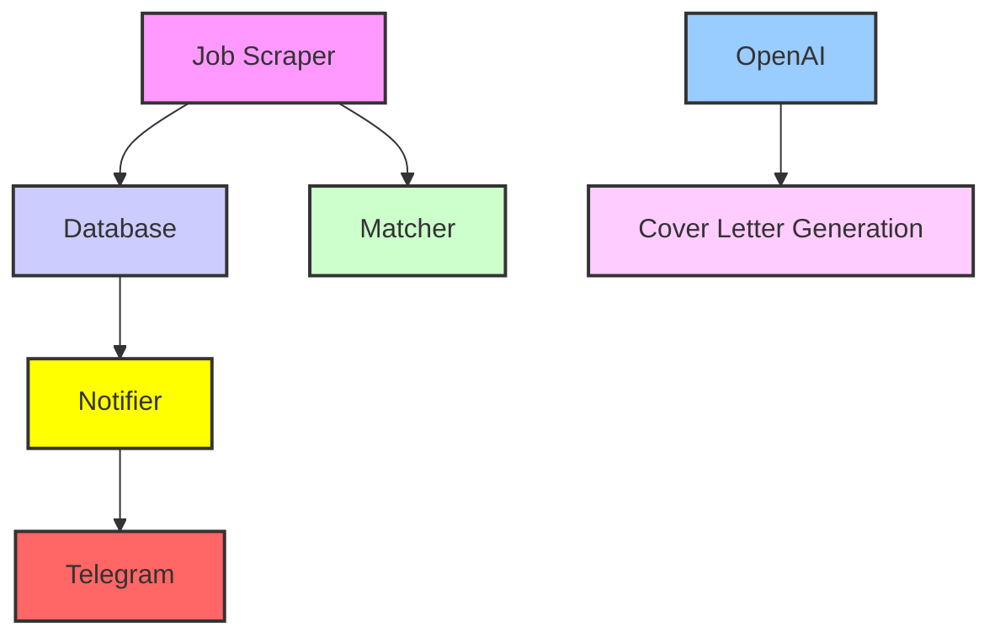

# Project Overview

This project implements a Wellfound job scraper that matches job listings with user profiles, leveraging SQLite for database management and Telegram for notifications. Additionally, it offers an optional feature for generating cover letters using OpenAI.

## Architecture

## Features
- Job scraping from Wellfound
- User profile matching
- Database management with SQLite
- Telegram notifications
- Optional OpenAI cover letter generation

## Getting Started
1. Clone the repository
2. Install dependencies
3. Set up environment variables:  
   - `OPENAI_API_KEY`
   - `TELEGRAM_BOT_TOKEN`
   - `TELEGRAM_CHAT_ID`

For detailed setup instructions, refer to the [CONFIG.md](config/CONFIG.md).
