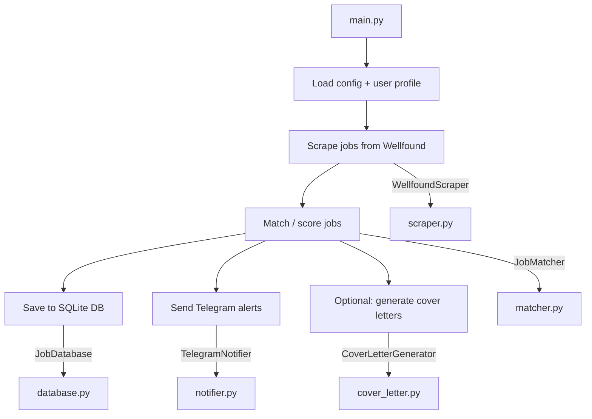
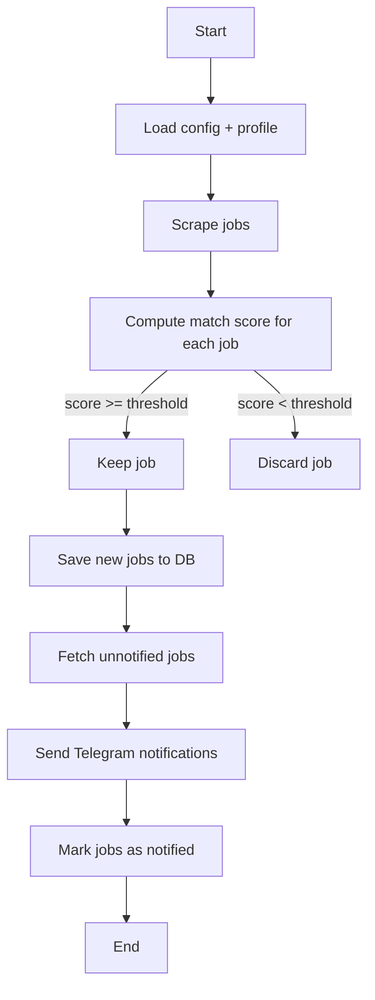

# `src/` Module Guide

This directory contains the core modules used by `main.py` to scrape jobs from Wellfound, score them against your profile, store them locally, and optionally notify you / generate cover letters.

---

## High-level flow (what happens when you run `python main.py`)

> Note: the current `main.py` flow prints samples to console; DB + notifier usage depends on how you wire calls (some modules are initialized but not always invoked in the shown snippet).

---

## File-by-file breakdown

### `scraper.py` — Wellfound scraping (Selenium + HTML parsing)
**Purpose**
- Visits Wellfound search results pages and collects job links.
- Opens each job page to extract full job details.
- Uses Selenium (Chrome) by default, with some anti-detection options.

**Key class**
- `WellfoundScraper(config: Dict)`

**Key behaviors / configuration inputs**
- `base_url`, `max_pages`, `delay_seconds`, `timeout`
- `use_selenium`, `headless`, `user_agents`

**Outputs**
- A list of job dictionaries (common fields include):
  - `id` (often a hash/unique key)
  - `title`, `company`, `location`
  - `short_description`, `full_description`
  - `skills`, `ui_skills`
  - `apply_url`

---

### `matcher.py` — scoring + filtering jobs against the user profile
**Purpose**
- Computes a relevance score (0–100) per job using:
  - skill matches (strong weight)
  - keyword matches (medium weight)
  - location match bonus

**Key class**
- `JobMatcher(user_profile: Dict)`

**Key methods**
- `calculate_match_score(job: Dict) -> int`
  - Adds:
    - `matched_skills`
    - `matched_keywords`
    - `location_match`
    - `match_score`
- `filter_jobs(jobs: List[Dict]) -> List[Dict]`
  - Filters by `min_match_score` and sorts by score desc.

**Important notes**
- Matching is substring-based: it lowercases and checks if skill/keyword text appears in the combined job text.
- If you add very generic skills/keywords, you may get inflated scores.

---

### `database.py` — SQLite persistence for jobs
**Purpose**
- Stores scraped + matched jobs in a local SQLite database so you can:
  - avoid duplicates
  - track notification status
  - keep history

**Key class**
- `JobDatabase(db_path: str = "data/jobs.db")`

**Key methods**
- `init_db()`
  - Creates table `jobs` if it doesn’t exist.
- `save_jobs(jobs: List[Dict]) -> int`
  - Inserts new jobs; skips duplicates via unique constraint on `job_id`.
- `get_unnotified_jobs(min_score: int = 0) -> List[Dict]`
  - Reads jobs where `notified = 0` and `match_score >= min_score`.
- (Typically you’ll also have) a method to mark jobs as notified (may exist later in the file).

**Data model (conceptual)**
- Stores job description fields, skill tags, score, and notification state.

---

### `notifier.py` — Telegram notifications
**Purpose**
- Sends job alerts through the Telegram Bot API.
- Provides formatting helpers and batching.

**Key class**
- `TelegramNotifier(bot_token: str, chat_id: str)`

**Key methods**
- `send_message(text: str, parse_mode: str = "Markdown") -> bool`
- `format_job_message(job: Dict) -> str`
  - Escapes special Markdown characters.
- `send_job_alerts(jobs: List[Dict], batch_size: int = 5) -> int`

**Requirements**
- Environment variables typically used:
  - `TELEGRAM_BOT_TOKEN`
  - `TELEGRAM_CHAT_ID`

---

### `cover_letter.py` — Optional OpenAI cover letter generation
**Purpose**
- Generates a tailored cover letter for a job, given:
  - job details
  - your user profile skills
  - matched skills

**Key class**
- `CoverLetterGenerator(api_key: str, model: str = "gpt-3.5-turbo")`

**Key methods**
- `generate(job: Dict, user_profile: Dict) -> Optional[str]`
- `_build_prompt(job: Dict, user_profile: Dict) -> str`

**Requirements**
- `OPENAI_API_KEY` must be set for this module to be enabled.
- Uses `from openai import OpenAI` and calls `client.chat.completions.create(...)`.

---

## Suggested orchestration (activity diagram)

This is a recommended end-to-end sequence you can implement (some parts may already exist in `main.py`, others may be easy additions):

---

## Quick tips
- If scraping fails or is slow, try:
  - lowering `max_pages`
  - increasing `delay_seconds`
  - setting `headless=false` to debug
- If Telegram messages look broken:
  - try `message_format: "Markdown"` (case-sensitive in many examples)
  - ensure escaping is correct for the chosen parse mode
